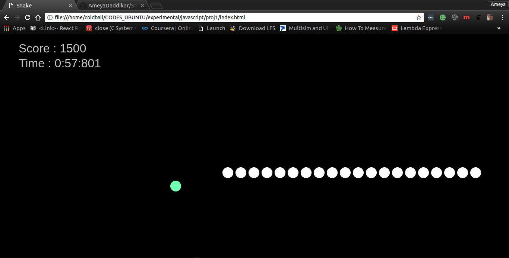

# Snake
## Using p5 JS

Snake is a recreation of the vintage snake game, developed to work on cross browser platforms for various devices.

I took on this project to learn to make light browser games and canvases and to get acquainted with the p5 JS library. This game is further meant to be assigned to the freshers as a begineer's project, so they can build a project (using other languages and libraries like PyGame) on their own having this game as a reference.

### The game has a very minimilistic object rendering with two categories of objects made from the same class
#### 1. foodBlock
#### 2. playerBlocks (array of player blocks)

### The collision detection is quite simple, and takes place in the following way
the absoulte distance between the x and y coordinates of the headBlock and the rest of the playerBlocks (and foodBlock) is less than some previously set value. 

### Following are some of the features to be added to the project :
1. Add a UI and link it with the game, wherein attributes like the color, game speed, etc. can be tweaked with a switch of a button or a slider.
2. Change the control configurations to support touchscreen devices.
3. Improve the collision detection, especially for the playerBlock-playerBlock collisions.
